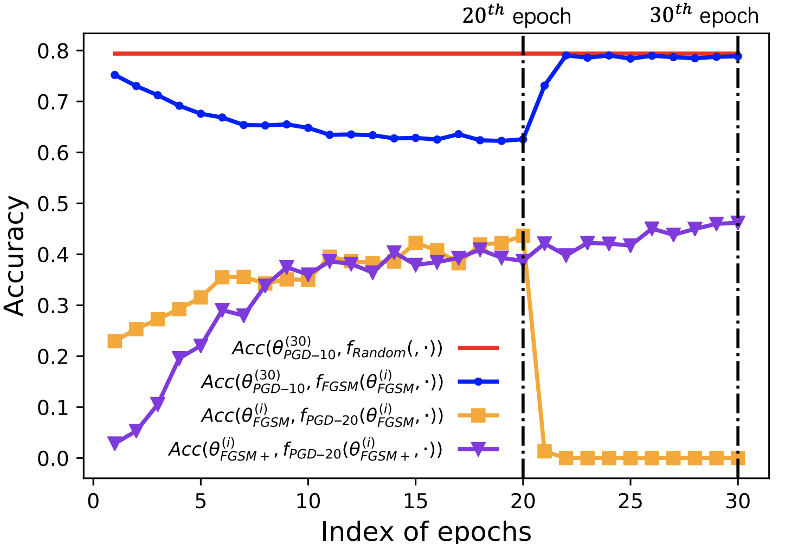

<h2 align="center">APART</h2>
<h5 align="center">Overfitting or Underfitting? Understand Robustness Drop in Adversarial Training</h5>

We are in an early-release beta. Expect some adventures and rough edges.

## Table of Contents

- [Introduction](#introduction)
- [Gradient Vanishing](#gradient-vanishing)
- [Amplification Effect](#dependency-and-amplification-effect)
- [Quick Start](#quick-start-guide)
- [Citation](#citation)

## Introduction
We analyse FGSM-Generated Perturbations for Pre-ResNet18. As visualized below, although FGSM-generated perturbations can surgically doctor the image at
the 20th epoch, they deteriorate into random noise at the 30th epoch. 
As the deterioration of FGSM, the robust perforamnce of FGSM adversarial training drops to zero.

 <p align="center">  </p>
 <p align="center">  </p>


This phenomenon (robustness drop) has been widely observed after conducting adversarial training for too long. As the common wisdom views this phenomenon as overfitting, our analyses suggest that the primary cause of the robustness drop is **perturbation underfitting**. Guided by our analysis, we propose APART, an adaptive adversarial training framework, which parameterizes perturbation generation and progressively strengthens them. Apart is not only 4 times faster than PGD-10, but suffers less from robustness drop and performs better. 

<p align="center">  </p>

## Quick Start Guide

The code is partly forked from the [ATTA adversarial training repository](https://github.com/hzzheng93/ATTA), with the corresponding modifications for APART.

### Prerequisites
- Python 3.6.3
- Pytorch 1.3.1, torchvision 0.6.0
- Apex 0.1.0

### Examples for training and evaluate
```
python train.py --layerwise --gpuid 0

```

## Citation
Please cite the following paper if you found our model useful. Thanks!

>Zichao Li<sup>*</sup>, Liyuan Liu<sup>*</sup>, Chengyu Dong and Jingbo Shang (2020). Overfitting or Underfitting? Understand Robustness Drop in Adversarial Training. arXiv preprint arXiv:2010.08034 (2020).

```
@article{li2020apart,
  title={Overfitting or Underfitting? Understand Robustness Drop in Adversarial Training},
  author = {Li, Zichao and Liu, Liyuan and Dong, Chengyu and Shang, Jingbo},
  journal={arXiv preprint arXiv:2010.08034},
  year={2020}
}
```
