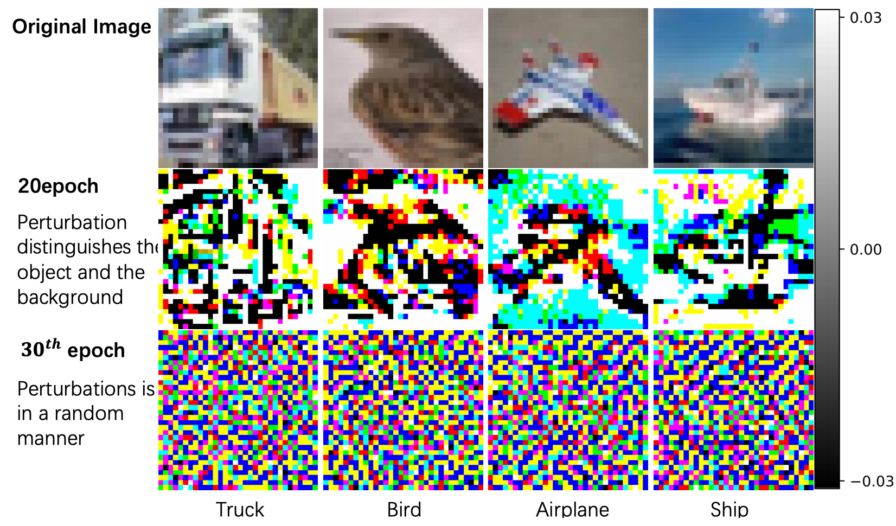
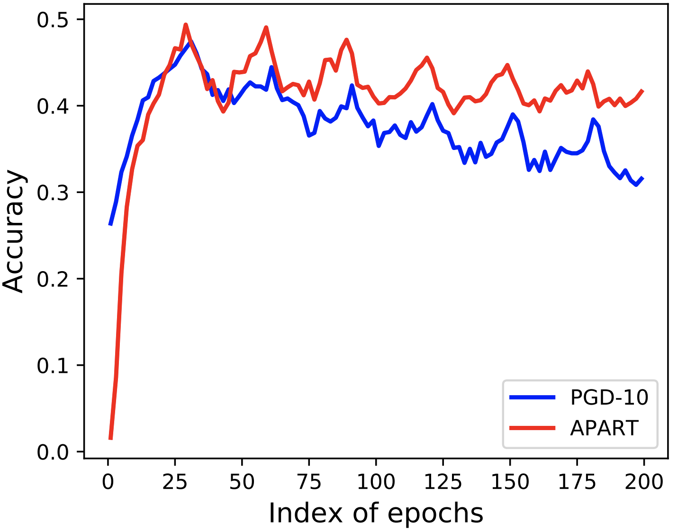

# Overfitting or underfitting? Understand robustness drop in adversarial training
A repository which implements an
adaptive adversarial training framework(APART), providing comparable or even better robustness than PGD-10 adversarial training, with only about 1/4
of its computational cost. Created by Zichao Li<sup>*</sup>, [Liyuan Liu<sup>*</sup>](https://liyuanlucasliu.github.io/), Chengyu Dong and [Jingbo Shang](https://shangjingbo1226.github.io/)(*Equal contributions). See our paper on arXiv [here](https://arxiv.org/abs/2010.08034). The code is partly forked from the [ATTA adversarial training repository](https://github.com/hzzheng93/ATTA), with the corresponding modifications for APART.

## Prerequisites
- Python 3.6.3
- Pytorch 1.3.1, torchvision 0.6.0
- Apex 0.1.0

## Examples for training and evaluate
```
python train.py --layerwise --gpuid 0

```
## Deterioration of FGSM
We analyse FGSM-Generated Perturbations for Pre-ResNet18. As
visualized in the figure, although FGSM-generated perturbations can surgically doctor the image at
the 20th epoch, they deteriorate into random noise at the 30th epoch. As the deterioration of FGSM, the robust perforamnce of FGSM adversarial training drops to zero.



## How to mitigate the robustness drop?

Robustness drop has been widely observed after conducting adversarial training for too long. Not only in FGSM adversarial trianing, there is also a robustness drop in PGD adverarial training.  As the common wisdom views this phenomenon as overfitting, our analyses suggest that the primary cause of the robustness drop is perturbation underfitting. We propose APART, an adaptive adversarial training framework, which parameterizes perturbation generation and progressively strengthens them. The following robust test accuracy curve shows APART V.S. PGD-10:



